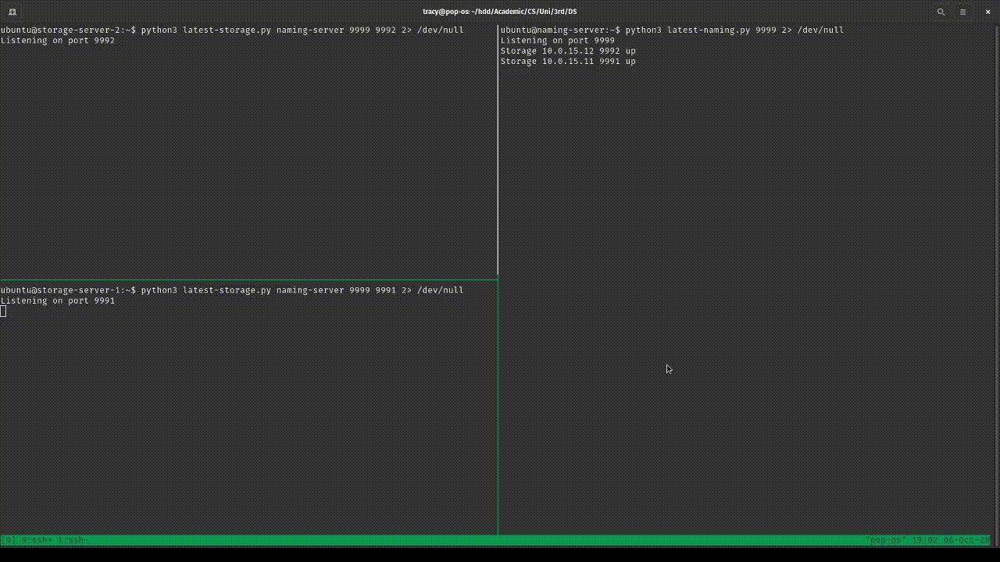
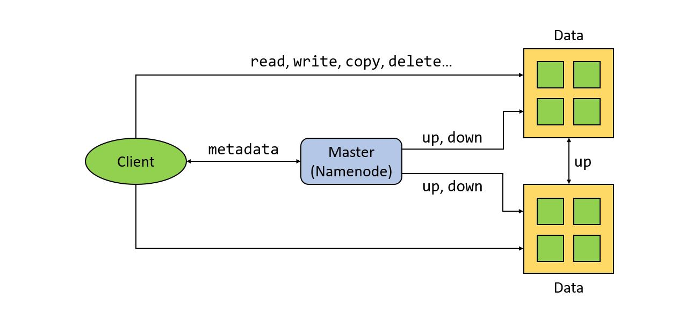
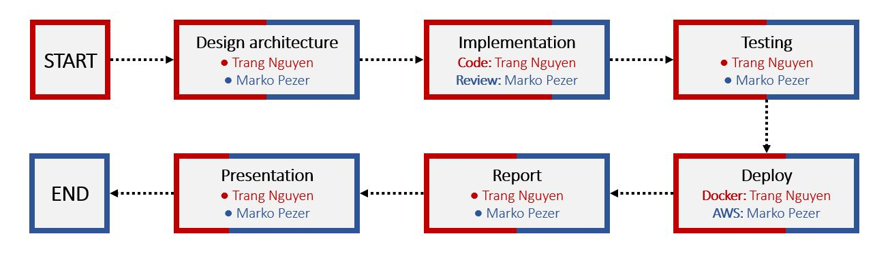

# Distributed Systems: Project 2 (Distributed File System)

Students: **Trang Nguyen (BS18-DS-01)** and **Marko Pezer (BS18-SE-01)**

Date: **October 2020**

This project is created for Distributed Systems course at Innopolis University, Russia.



## System launching and using

To download source code from this branch use:

```bash
git clone -b latest https://github.com/tracy2811/dfs.git
```

or use latest public docker image [tracy2811/dfs:latest](https://hub.docker.com/r/tracy2811/dfs)

### 1. Launching naming server

To start the naming server run `naming.py` with `NAMING_PORT` as an argument:

```bash
# From source code
python naming.py NAMING_PORT

# From Docker image
docker run --network=host tracy2811/dfs:latest python naming.py NAMING_PORT
```

### 2. Launching storage servers

Multiple storage servers can join to the DFS network. 
To start any of them, run `storage.py` with three arguments (`NAMING_ADDR`, `NAMING_PORT`, `STORAGE_PORT`):

```bash
# From source code
python storage.py NAMING_ADDR NAMING_PORT STORAGE_PORT

# From Docker image
docker run --network=host tracy2811/dfs:latest python storage.py NAMING_ADDR NAMING_PORT STORAGE_PORT
```

### 3. Client usage

`client.py` provides an interactive shell for user to take actions on the DFS. It requires two arguments (`NAMING_ADDR`, `NAMING_PORT`). 
For the new system, `init` action is required. Client at any time can execute this `init` action to format the system.

```bash
# From source code
python client.py NAMING_ADDR NAMING_PORT

# From Docker image
docker run -it --network=host tracy2811/dfs:latest python client.py NAMING_ADDR NAMING_PORT
```

The table below shows command supported by the current client shell.

Command | Description
--- | ---
`init` | Initialize client storage on the new system, can be used to format the system
`touch files...` | Create new empty files
`get file` | Download a file from DFS to client side
`put src dst` | Upload file from client side to DFS
`info file` | Get file's information, i.e., mode, size, and modification time
`cp src dst` | Create a copy of a file src to dst
`mv src dst` | Move a file from src to dst. Can be used to rename a file
`rm targets...` | Delete files or directories
`cd dir` | Change current working directory
`ls dir`  | List files and directories
`mkdir dirs...` | Make new directories
`help` | Show help
`exit` | Quit interactive shell

## Architectural diagrams



## Description of communication protocols

We have used TCP IPv4 as communication protocol.

TCP IPv4 protocol works at the Network layer of the OSI model and at the Internet layer of the TCP/IP model. Thus, this protocol identifies hosts based upon their logical addresses (IP addresses).

## Contribution of each team member

During the working process we were helping each other in every part of the process. 

However, here is the graph that shows contribution of each team member.


