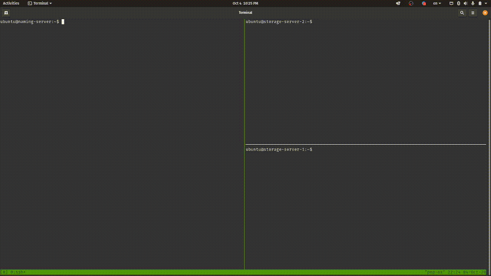

# Distributed Systems: Project 2 (Distributed File System)

Students: **Trang Nguyen (BS18-DS-01)** and **Marko Pezer (BS18-SE-01)**

Date: **October 2020**

This project is created for Distributed Systems course at Innopolis University, Russia.



## System launching and using

To download source code use

```bash
git clone https://github.com/tracy2811/dfs.git
```

or use public docker image [tracy2811/dfs:base](https://hub.docker.com/repository/docker/tracy2811/dfs)

NOTE: For rich and latest features, please use code from [latest](https://github.com/tracy2811/dfs/tree/latest) branch or docker image [tracy2811/dfs:latest](https://hub.docker.com/repository/docker/tracy2811/dfs). Documentation can also be found there.


### 1. Launching naming server

Start naming server by running `naming.py` with `NAMING_PORT` as argument

```bash
# From source code
python naming.py PORT

# Or from Docker image
docker run --network=host tracy2811/dfs:base python naming.py NAMING_PORT
```

### 2. Launching storage servers

Multiple storage servers can join to the DFS network. To start each of them, running `storage.py` with 3 arguments, i.e., `NAMING_ADDR`, `NAMING_PORT`, and `STORAGE_PORT` respectively.

```bash
# From source code
python storage.py NAMING_ADDR NAMING_PORT STORAGE_PORT

# Or from Docker image
docker run --network=host tracy2811/dfs:base python storage.py NAMING_ADDR NAMING_PORT STORAGE_PORT
```

### 3. Client usage

`client.py` provides an interactive shell for user to take actions on the DFS. It requires 2 arguments, i.e., `SERVER_ADDR`, and `SERVER_PORT` respectively. For new system, `init` action is required. Client at any time can execute this `init` action to format the system.

```bash
# From source code
python client.py NAMING_ADDR NAMING_PORT

# Or from Docker image
docker run -it --network=host tracy2811/dfs:base python client.py NAMING_ADDR NAMING_PORT
```

The table below shows command supported by the current client shell. For more flexible experience, please refer to [latest](https://github.com/tracy2811/dfs/tree/latest) branch.

Command | Description
--- | ---
`init` | Initialize client storage on the new system. Can be used to format the system.
`touch file` | Create a new empty file
`get file` | Download a file from DFS to client side
`put local_file file` | Upload file from client side local_file to DFS
`info file` | Get file's information, i.e., mode, size, and modification time
`cp src_file dst_file` | Create a copy of a file src_file under name dst_file
`mv src_file dst` | Move a file from src_file to dst. Can be used to rename a file
`rm target` | Delete a file or directory
`cd dir` | Change current working directory
`ls dir`  | List files and directories
`mkdir dir` | Make a directory
`help` | Show help
`exit` | Quit interactive shell

## Architectural diagrams


## Description of communication protocols

TCP IPv4 is used.

## Contribution of each team member

During the working process we were helping each other in every part of the process. However, there is a rough distribution of the jobs.

### Trang Nguyen (BS18-DS-01):

- General ideas
- Python coding
- Docker

### Marko Pezer (BS18-SE-01):

- General ideas
- Documentation and comments
- Drawing diagrams
