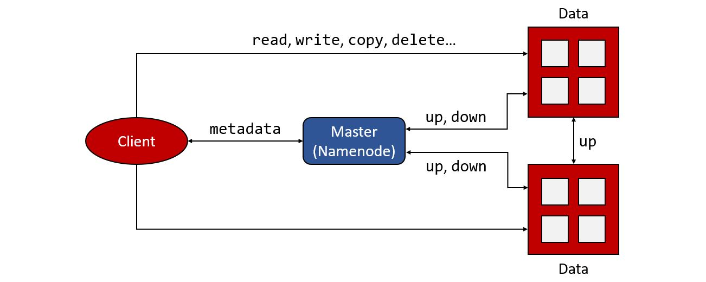

<h1>Distributed Systems: Project 2 (Distributed File System)</h1>

Students: <b>Trang Nguyen (BS18-DS-01)</b> and <b>Marko Pezer (BS18-SE-01)</b> 
Date: <b>October 2020</b> 

This project is created for Distributed Systems course at Innopolis University, Russia.

<h2>System launching and using</h2>

<h2>Architectural diagrams</h2>

<h2>Description of communication protocols</h2>

<h2>Contribution of each team member</h2>

During the working process we were helping each other in every part of the process. 
However, there is a rough distribution of the jobs.

<h4>Trang Nguyen (BS18-DS-01):</h4>

<ul>
  <li>General ideas</li>
  <li>Python coding</li>
  <li>Docker</li>
</ul>

<h4>Marko Pezer (BS18-SE-01):</h4>

<ul>
  <li>General ideas</li>
  <li>Documentation and comments</li>
  <li>Drawing diagrams</li>
</ul>
